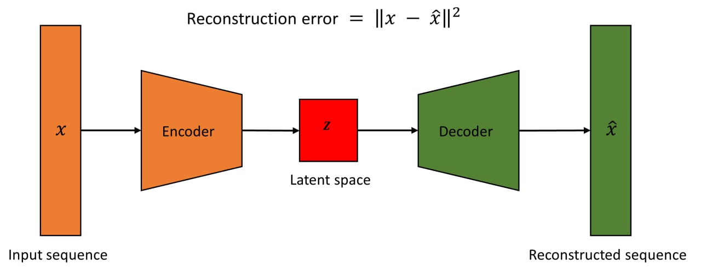

# Anomaly-Detection-with-Autoencoders-Pytorch

This repository contains implementation of unsupervised learning of anomaly detection of time series data using recurrent neural networks (LSTM, GRU) autoencoders in PyTorch.

# References:
Lawal, W. A., Kea, K., Han, Y., Young, J. M., & Kim, T. (2022). A deep learning approach to detect anomalies in an electric power steering system. Sensors, 22(22), 8981. doi:https://doi.org/10.3390/s22228981
